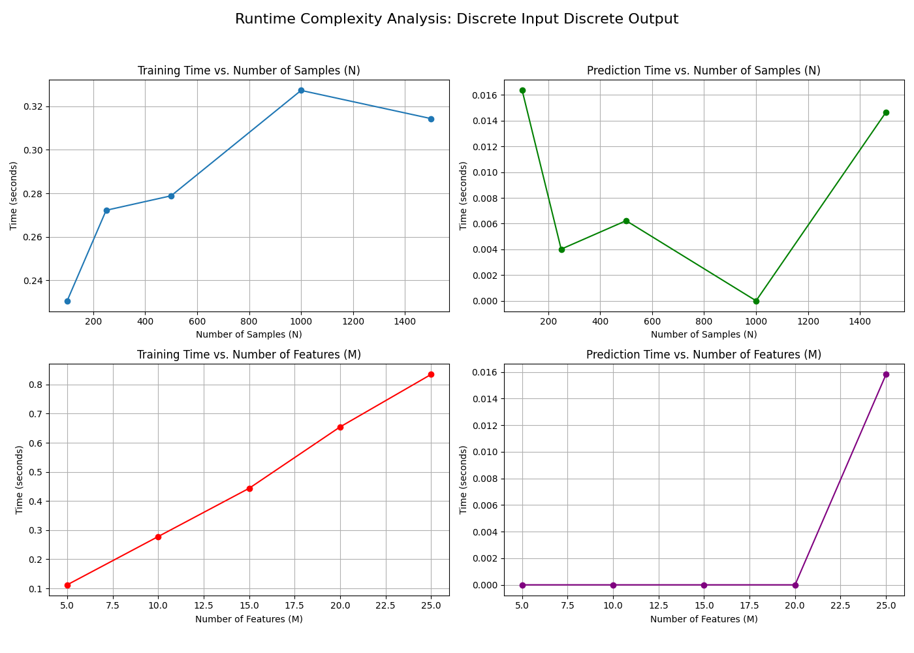
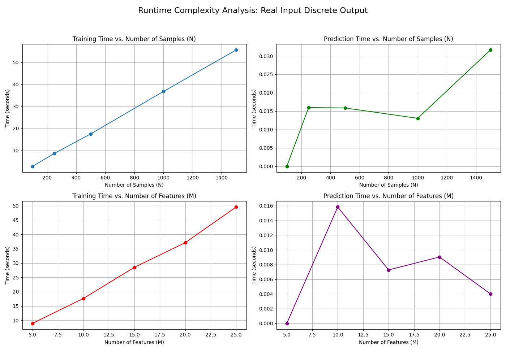
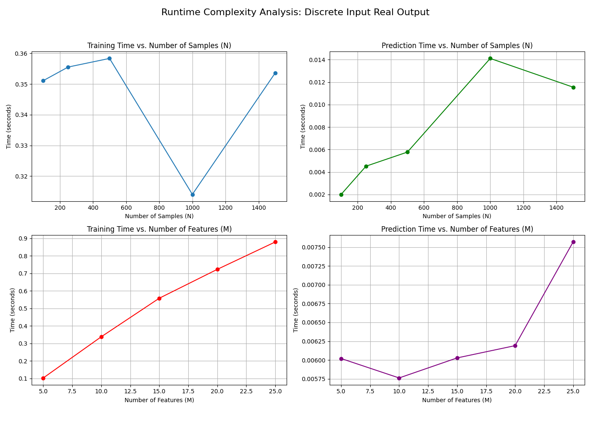
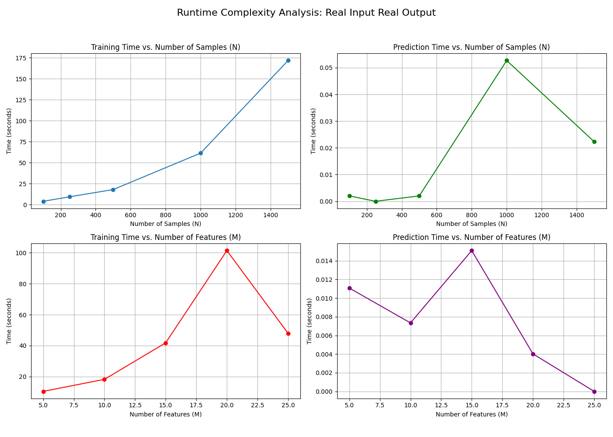

### Theoretical Time Complexity

-   **Training (fit)**: The time to build a decision tree is typically dominated by the process of finding the best split at each node. For a dataset with **N** samples and **M** features, the complexity is approximately **O(N \* M \* D)**, where D is the depth of the tree. For real-valued features, sorting at each node can increase this to **O(N \* log(N) \* M \* D)**.
-   **Prediction (predict)**: The time to predict a single sample involves traversing the tree from the root to a leaf. This takes **O(D)** time. For predicting **k** test samples, the complexity is **O(k \* D)**.

---

## Experimental Analysis

We analyzed the four required cases for the decision tree. The plots below show the empirical results.

### Case 1: Discrete Input, Discrete Output

-   **Training Time vs. N**: The plot shows a nearly linear relationship, which aligns with the theoretical complexity of O(N).
-   **Training Time vs. M**: The time increases linearly with the number of features, consistent with the O(M) factor in the complexity.
-   **Prediction Time**: Both plots show a clear linear relationship with the number of samples (k in our theory), as expected. The number of features (M) has a less pronounced impact because prediction only depends on the tree's depth, not the total number of features.

### Case 2: Real Input, Discrete Output

-   **Training Time vs. N**: The curve shows a slightly super-linear trend, which is consistent with the theoretical **O(N \* log(N))** complexity due to the sorting of real-valued features at each split.
-   **Training Time vs. M**: The relationship is again linear, matching the O(M) component.
-   **Prediction Time**: The results are very similar to the discrete case, showing a linear dependency on the number of test samples.

### Case 3: Discrete Input, Real Output

-   **Analysis**: The results are nearly identical to the "Discrete Input, Discrete Output" case. This is expected because the input type (discrete features) is the primary driver of the training complexity, while the output type (real vs. discrete) mainly affects the impurity calculation, which has a minimal impact on the overall runtime.

### Case 4: Real Input, Real Output

-   **Analysis**: These plots closely mirror the "Real Input, Discrete Output" case. The dominant factor for training time is again the **O(N \* log(N) \* M)** complexity from handling real-valued features.

### Conclusion

Our experimental results strongly support the theoretical time complexities for decision tree construction and prediction. The training time scales approximately as **O(N log N \* M)** for real inputs and **O(N \* M)** for discrete inputs. Prediction time scales linearly with the number of test samples, **O(k)**, and is largely independent of the number of features.